# Base Shaders
This is a list of all of the built-in LK3D base shaders, with screenshots.  
Most of these only work when the models are non-cached, as they need to be updated constantly.  

---

 `reflective`  

Spheremap shader, maps a 2D sphere map onto a 3D model, used to make shiny *metallic* objects  
**This shader is really expensive! Its advised to use** `reflective_screen_rot` **if your model has smooth normals!**

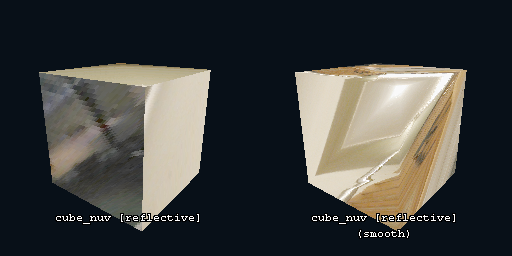

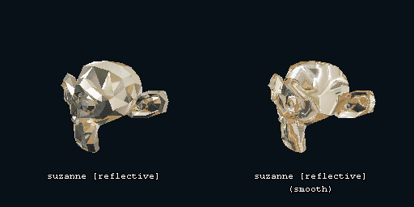

---

 `reflective_simple`  

Faster, lazier and horribly broken version of `reflective`  
This shader is mostly phased out by `reflective_screen_rot`  
**Breaks with non-smooth normals**  
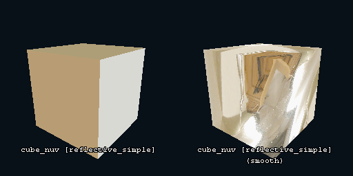
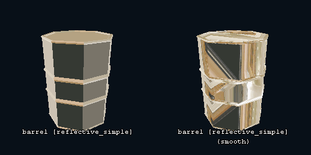
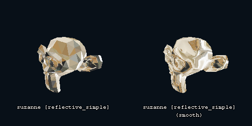

---

 `reflective_screen_rot`  

Maps a spheremap to a model using the screenspace instead  
**Breaks with non-smooth normals**  
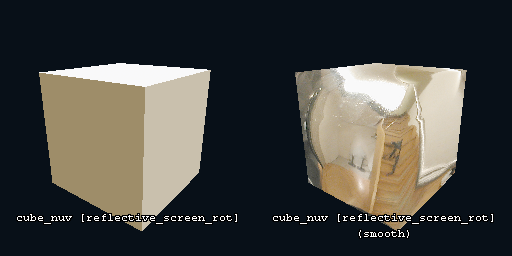
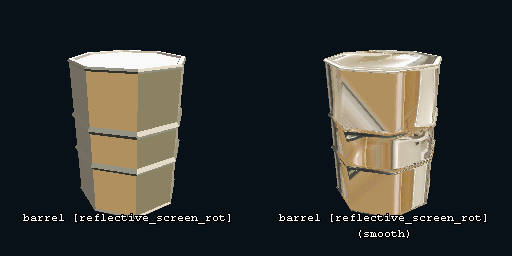
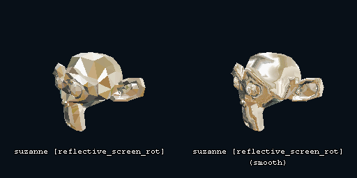

---

 `specular`  

Hacky specular shader, looks horrible and runs horrible too!  
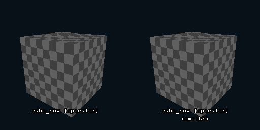
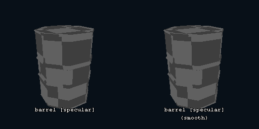
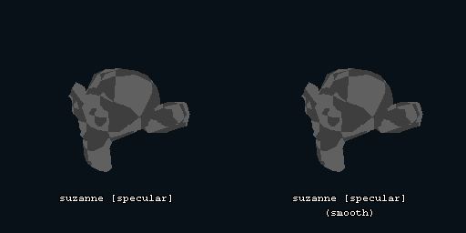

---

 `norm_vis`  

Shows the **rotated** normals as the vertex colours  

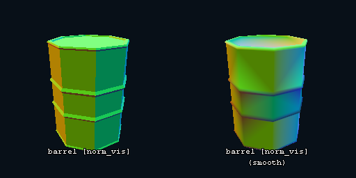
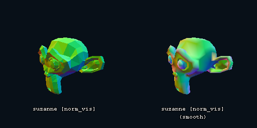

---

 `norm_vis_rot`  

Unlike what it name implies, shows the **non-rotated** normals as the vertex colours  
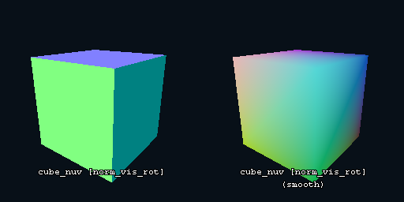
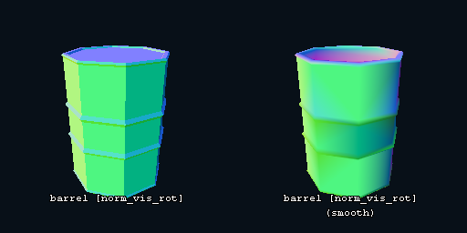
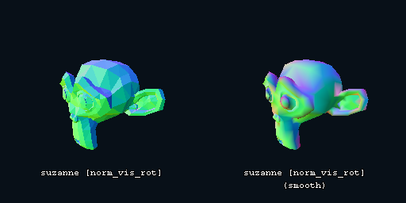

---

 `norm_screenspace`  

Deprecated  

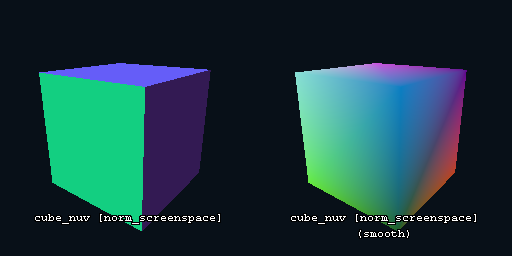
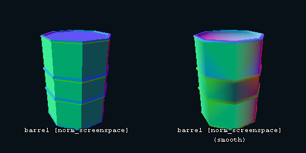
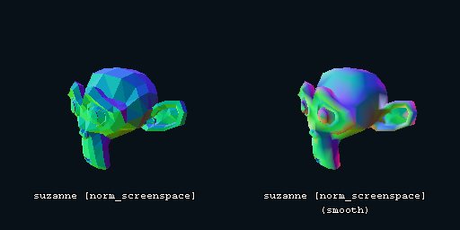

---

 `norm_screenspace_rot`  

Shows **screen-space** normals as the vertex colours  

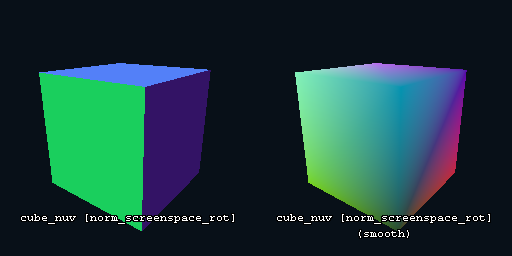
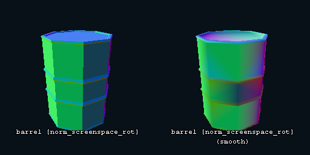
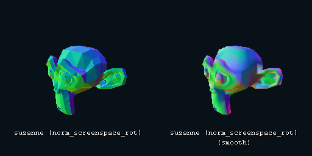

---

 `world_pos`  

Shows the world position of each vertex as the vertex colours  
**Only works in positions between Vector(-8, -8, -8) & Vector(8, 8, 8)**  

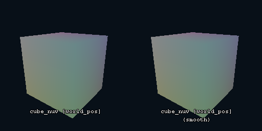

---

 `world_pos_local`  

Shows the position local to the camera of each vertex as the vertex colours  

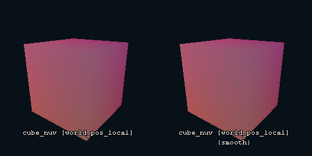
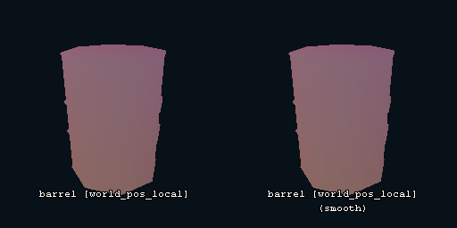
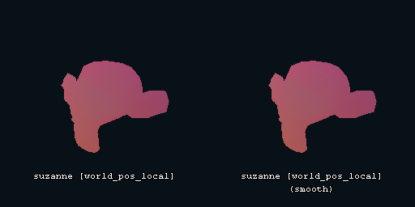

---

 `vert_col`  

Sets the vertex colour of each vertex to the hue of their index  

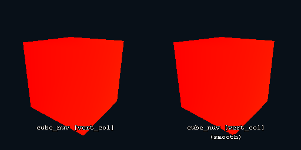
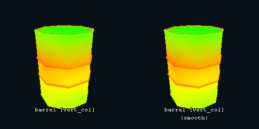
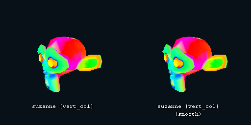

---

 `ps1`  

PS1-Like vertex wobble shader, effectively floors vertex positions  

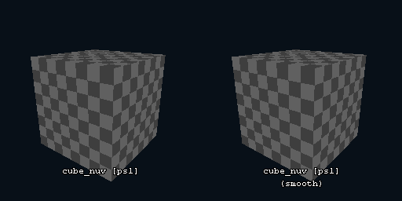
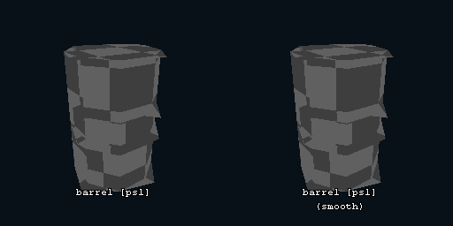
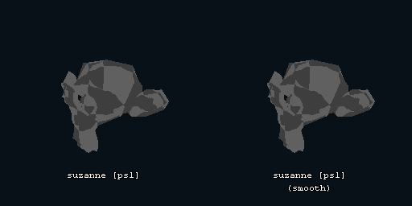